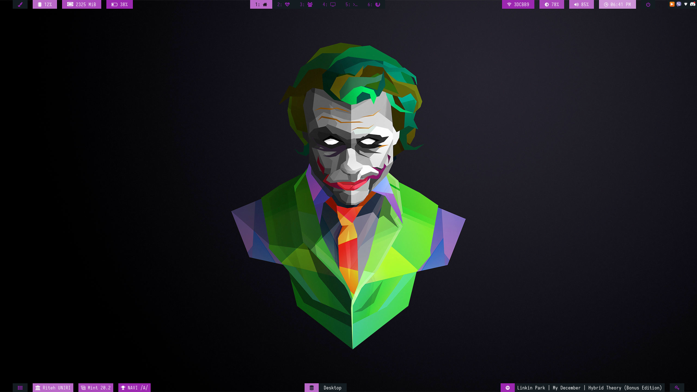
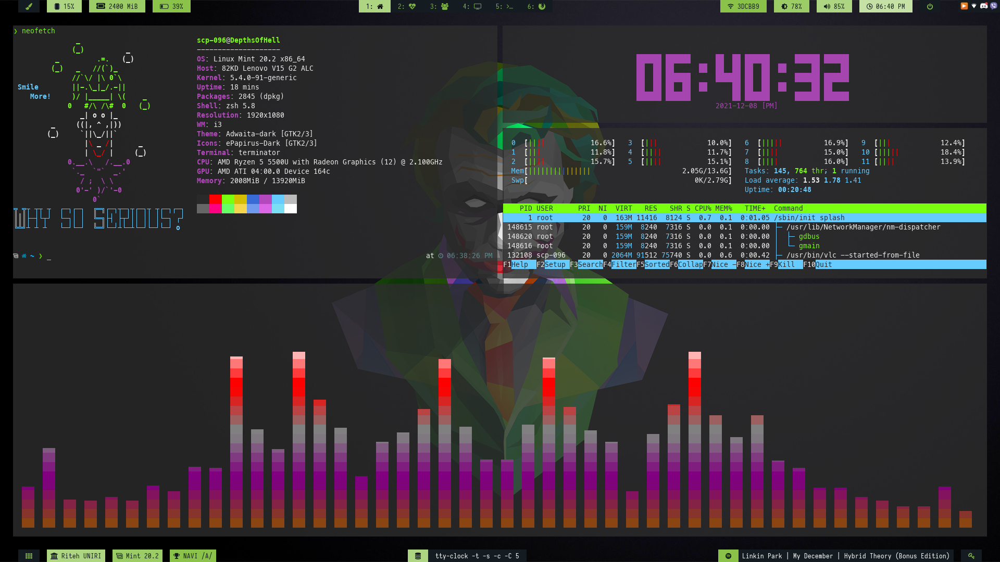

# Dotfile for Linux Mint 20.2 [i3-gaps]

## A description of what the project is for.
- My first attempt at ricing Linux Mint "Uma" that I use as a daily driver. Inspiration came from https://www.reddit.com/r/unixporn/ . 
- Kali Linux is my next goal [ for ricing and for cyber security experience :) ] . 

## Screenshots

## Specifications

- Distro: `Linux Mint 20.2 x86_64`
- WM: `i3-gaps`
- Bar: `Polybar`
- Shell: `zsh 5.8`
- Text editor: `Vim`
- File manager: `nemo`
- Terminal: `terminator`
- Compositor: `compton` [ for background transparency ]
- Terminal apps: `neofetch`, `tty-clock`, `htop`, `cava`
- Wallpaper link: https://i.pinimg.com/originals/be/f0/56/bef056084c44e811f834bd1640931ff2.jpg

## TO DO LIST [ FIXED ] 
Base model is made, but few things need to be worked on:
- Fix HDMI port `¯\_(ツ)_/¯`
- Setup polybar for the second monitor [ `workspaces` ]
- Fix Brightness [ `light` ] and Player control [ `Play`, `Pause`, `Stop` ]
